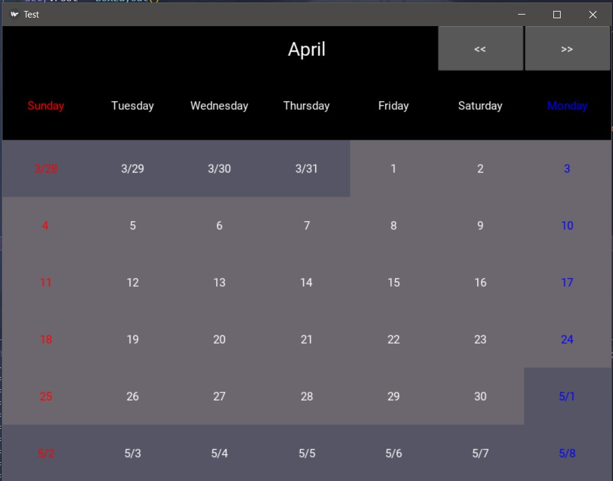
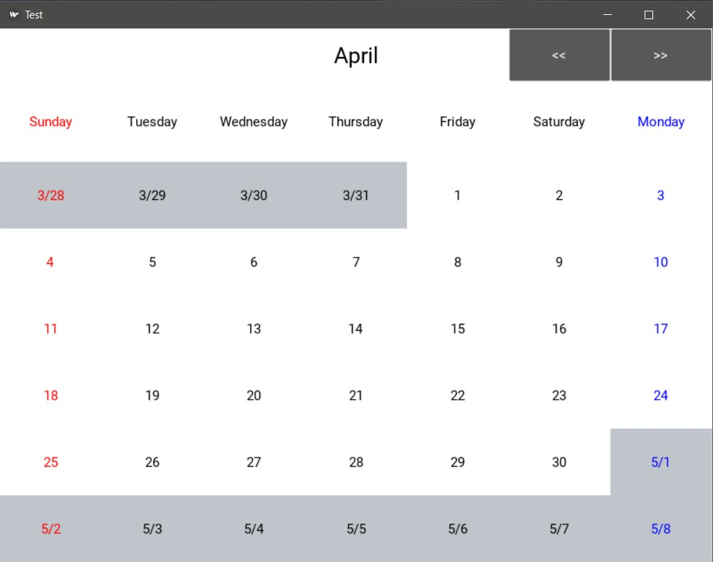
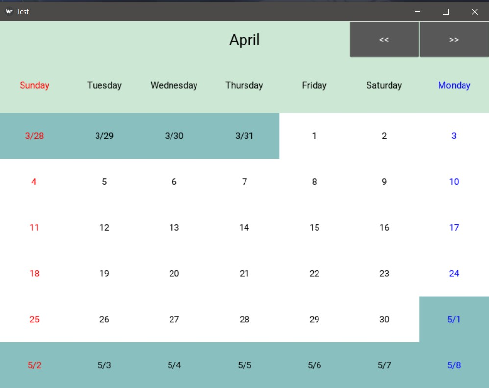
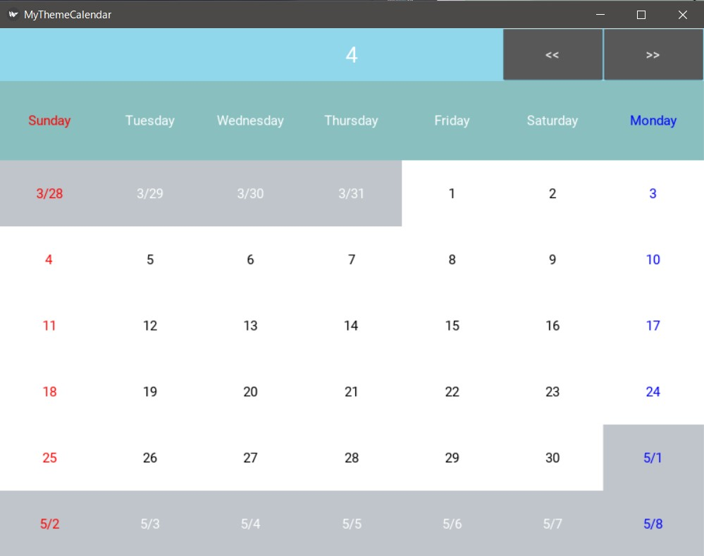
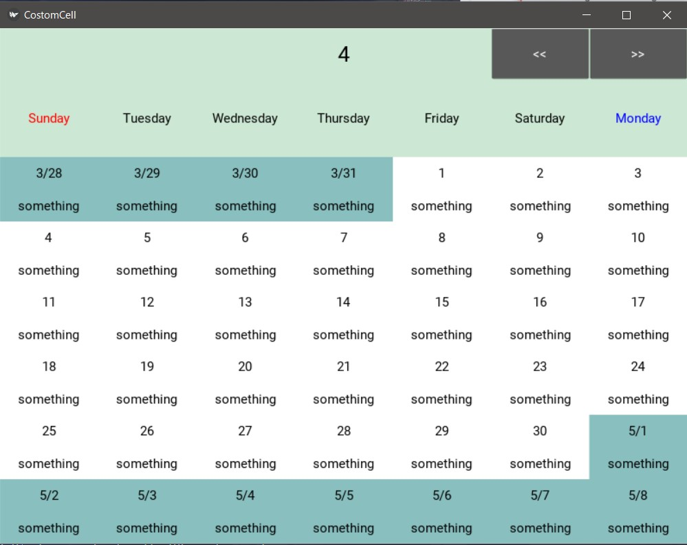

# Calendar Widget

A simple calendar widget written by pure Python and Kivy.

unreleased now.



## features

- this calendar only shows days, dates, year and month.
- you can set some functions that is called when a user selects a day, or deselects it, and when calendar goes to next month or previous month.
- you can customize appearance of this calendar easily. See some files in sample folder.

## event

You can set some functions when called on a certain condition. Here are all of them.

| name                | when called                                                       | args                                                                          |
| ------------------- | ----------------------------------------------------------------- | ----------------------------------------------------------------------------- |
| `on_next_month`     | when the shown month on the calendar changes its **next** one     | instance: KivyCalendarWidget, cell: DateCell, month_src: int, month_dest: int |
| `on_previous_month` | when the shown month on the calendar changes its **previous** one | instance: KivyCalendarWidget, cell: DateCell, month_src: int, month_dest: int |
| `on_day_select`     | when user selects a day                                           | instance: KivyCalendarWidget, cell: DateCell                                  |
| `on_day_deselect`   | when user deselects a day                                         | instance: KivyCalendarWidget, cell: DateCell                                  |

See more [sample/basic.py](sample/basic.py).

## customization

You can customize this calendar widget easily.
Two ways mainly exists as below shown.

### color theme

Now I prepare three themes; default theme, light theme and ice green theme.

Default theme is here.

Light theme is here.

Ice green theme is here.


But you can make your own theme!

```Python3
from kivycalendarwidget.colors import ColorTheme, KivyColors
# You can customize calendar appearance easily by using ColorTheme(NamedTuple).
MyTheme = ColorTheme(
    title_background_color=KivyColors.SKY_BLUE,
    header_background=KivyColors.AQUA_GREEN,
    nowdays_background=KivyColors.WHITE,
    nowdays_color=KivyColors.BLACK,
    previousdays_background=KivyColors.SKY_GRAY,
    nextdays_background=KivyColors.SKY_GRAY
)
c = KivyCalendarWidget(theme=MyTheme)
```
MyTheme is like this;


See [sample/customtheme.py](./sample/customtheme.py).

### date cell

You may want to show some text in date for example your schedules.
Of course you can do!
First of all, you must define your own date cell class like below.

```Python3
from kivy.uix.boxlayout import BoxLayout
from kivy.lang.builder import Builder

from kivycalendarwidget import DateCellBase
from kivycalendarwidget.backgroundwidgets import BackgroundLabel

Builder.load_string('''
<MyDateCell>:
    orientation: 'vertical'
    label_date: lbl_date
    label_schedule: lbl_schedule
    BackgroundLabel:
        id: lbl_date
        background_color: root.background_color
        size_hint_y: 0.5
    
    BackgroundLabel:
        id: lbl_schedule
        background_color: root.background_color
        size_hint_y: 0.5
        text: 'something'
''')

class MyDateCell(DateCellBase, BoxLayout):
    label_date: BackgroundLabel
    label_schedule: BackgroundLabel
    def __init__(self, day: int, date: str, month: int, is_now_month: bool, **kwargs):
        super(MyDateCell, self).__init__(day, date, month, is_now_month, **kwargs)
        self.label_date.text = str(date) if is_now_month else f'{month}/{date}'
    
    # @overwrite
    def set_color(self, color: KivyRgbaColor):
        self.label_date.color = color
        self.label_schedule.color = color
    # @overwrite
    def set_background_color(self, background_color: KivyRgbaColor):
        self.label_date.background_color = background_color
        self.label_schedule.background_color = background_color
        self.background_color = background_color

    def set_schedule(self, text: str):
        self.label_schedule.text = text
```

Note that `class MyDateCell` is required to comply with requirements below.

- extends kivycalendarwidget.DateCellBase and a widget class in Kivy.
- arguments of `__init__` method are (self, day: int, date: str, month: int, is_now_month: bool, **kwargs).
- implements `set_color` method.
- recommend to implements `set_background_color` method.

If you want to use calendar theme colors, you can access  them via `self.themes`.

Second, you must set your class when you make `kivycalendarwidget.KivyCalendarWidget` instance via `cell_cls` argument.

```Python3
c = KivyCalendarWidget(
    cell_cls=MyDateCell
)
```

The appearance of KivyCalendarWidget will be like this.



**Note that the state of DateCell is initialized when user changes a different month.**
I would like to update this spec in order to hold its state.

See [sample/costomcell.py](./sample/costomcell.py)

## requirements

Maybe independent on the version of Kivy.
But in src code, I used `typing.Annotated` which is added in python 3.9.
So if you use python 3.8 or below, you must install `typing_extensions` via `pip install typing_extensions`.
Note that Python 2.x is not supported.

