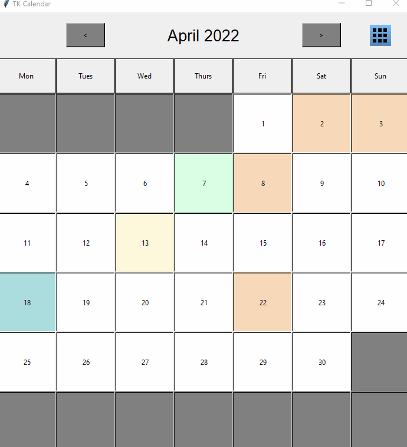

# TK-Calendar-and-Event-DB
TKinter Calendar GUI with integrated TinyDB events manager

TK-Calendar is a Calendar GUI enhanced with an event database. Events are easy and simple to customize with a topwindow GUI that allows for date picking and event manipulation. I initially made TK-Calendar as a plug in to my home-hub Cherry-Pi project. TK-Calendar can be integrated to any of your TK-Projects by simply changing inheritance of [The main window class: TKCalendar to Toplevel, rather than TK](TKCalendar/main.py) and binding a callable to open the calendar.

A few useful tools for TKinter devs can be found in [TKCalendar/tkwidgetclasses](TKCalendar/tkwidgetclasses), such as reactive hover buttons, number only comboboxes, and text filled entries that clear text on clicking. 

## To Use
• Clone repository  
• Open project directory in IDE  
• python main.py in terminal  

# A few features of TK-Calendar:

## Reactive Date Buttons:
Hovering the date buttons with a pointer will reactively highlight the date buttons for easy visibility. Current day is marked on the calendar as green, and unused date buttons are deactivated and unresponsive.

# Intuitive Event Controller:
Simple to use form to manually input events.

## Changing Events...
Simple to use form that autopopulates to change event information.

## Removing Events...
Confirmation for event removal with details.

